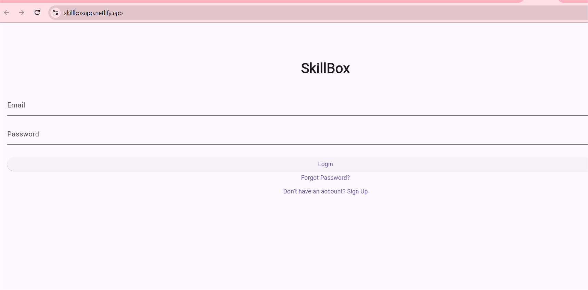

# 💼 SkillBox App – Learn. Earn. Thrive.

SkillBox is a mobile-first platform designed to empower African youth with **digital skills**, **life skills**, and **real-world job opportunities**. With accessible courses, certifications, community support, and mobile money integration, SkillBox is more than an edtech app — it's a launchpad for success.

---

## 🚀 Features

- 🎓 Learn digital & creative skills (Graphic Design, Canva, Digital Marketing, etc.)
- 📺 Watch video lessons (YouTube integration)
- 📝 Take quizzes and earn certificates
- 💼 Connect to job & freelance opportunities (coming soon)
- 🔐 Secure login, signup, and password reset
- 💬 Community support features (coming soon)
- 💰 M-Pesa mobile money integration (coming soon)

---

## 📷 Screenshots
### 🔐 Login Page


### 🎓 Course List


### 🎓 Youtube Tutorials

> 
---

## 🧱 Built With

- **Flutter** (Frontend)
- **Firebase** (Auth, Firestore, Storage)
- **YouTube API** (Video content)
- **M-Pesa API** (Mobile payments – planned)
- **Netlify** (Web deployment)

---

## 📦 Getting Started

### Prerequisites

- Flutter SDK installed
- Firebase account & project setup
- Android Studio or VS Code

### Installation

```bash
git clone https://github.com/your-username/skillbox-app.git
cd skillbox-app
flutter pub get
flutter run
